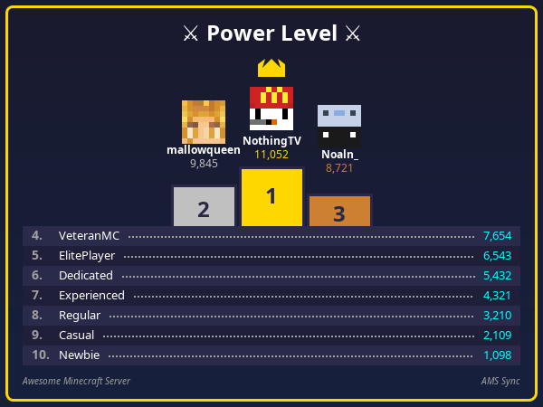
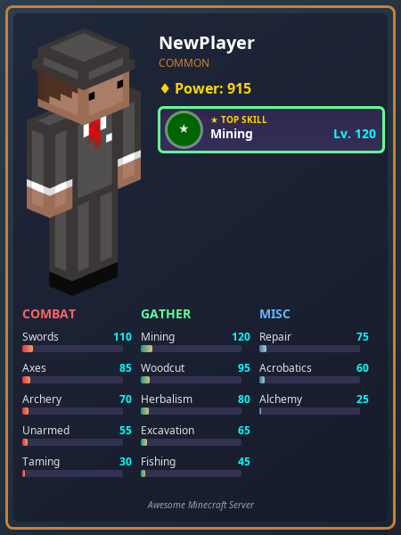
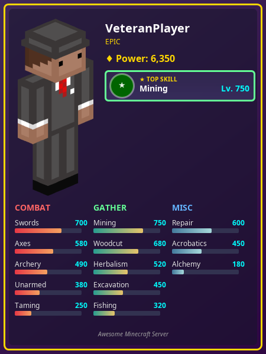
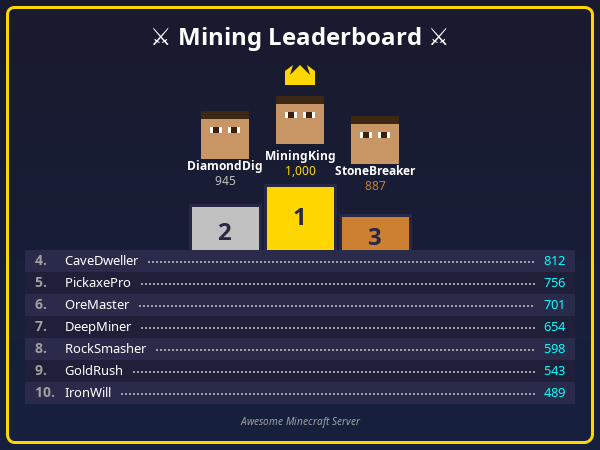

# AMSSync

A Paper/Spigot Minecraft plugin that bridges Discord and MCMMO for the Amazing Minecraft Server (AMS). This plugin embeds a Discord bot directly into your Minecraft server, allowing Discord users to check MCMMO stats, view leaderboards, and interact with server data through slash commands.

## Overview

AMSSync eliminates the need for separate bot hosting by integrating Discord functionality directly into your Minecraft server plugin. It provides a seamless experience for players to track their MCMMO progression from Discord, with intelligent user linking for easy administration.

## Key Features

### Visual Player Cards

Generate stunning player stats cards and Olympic podium leaderboards directly in Discord!

<p align="center">
  
  
</p>

- **`/amsstats`** - Beautiful player cards with full body skin render, all skills with progress bars, and rarity classification
- **`/amstop`** - Olympic-style podium leaderboards with player avatars and crown for 1st place
- **Rarity System** - Cards display Common, Rare, Epic, or Legendary based on power level
- **Mastery Stars** - Skills at level 2000+ display golden mastery stars
- **Category Colors** - Combat (red), Gathering (green), and Misc (purple) skill groupings

### Bidirectional Chat Bridge

Seamlessly connect your Minecraft server chat with Discord - messages flow both ways in real-time.

- **Minecraft → Discord**: Player messages appear in Discord with optional webhook support for player avatars
- **Discord → Minecraft**: Discord messages broadcast to all online players with `[Discord]` prefix
- **Webhook Avatars**: When enabled, messages show the player's Minecraft head as the sender
- **Configurable Formats**: Customize how messages appear in both directions
- **Smart Filtering**: Automatically ignores commands and sanitizes mentions

### MCMMO Milestone Announcements

Celebrate player achievements with automatic Discord announcements when players hit skill milestones!

- **Skill Milestones**: Announce when players reach level 100, 200, 300, etc. (configurable interval)
- **Power Level Milestones**: Celebrate total power level achievements (500, 1000, 1500, etc.)
- **Visual Celebration Cards**: Optional image cards with tier badges and player avatars
- **Embed Fallback**: Clean Discord embeds when image cards are disabled

### Discord Integration
- **Embedded Discord Bot**: JDA-powered bot runs within the plugin (no separate process needed)
- **Slash Commands**: Modern Discord slash command interface
- **Real-time Stats**: Live MCMMO data from both online and offline players
- **Automatic Reconnection**: Built-in retry logic with exponential backoff
- **Event Announcements**: Server start/stop, player deaths, and achievements
- **Webhook Support**: Optional webhooks for custom avatars and usernames

### MCMMO Integration
- **Full Stats Access**: Query individual skill levels, power levels, and leaderboards
- **Flatfile Support**: Direct DatabaseManager integration for reading offline player data
- **Cached Leaderboards**: 60-second cache to prevent server strain (configurable)
- **Timeout Protection**: Configurable timeout manager prevents long-running queries from blocking

### User Linking System
- **Quick Linking**: Fast 2-command workflow with `/amssync quick`
- **Number-Based Selection**: Session-based numbered lists (no copying/pasting Discord IDs)
- **Session Management**: 5-minute auto-expiring sessions per admin
- **Discord Name Display**: Shows Discord display names instead of IDs for better UX
- **Discord Admin Commands**: Server admins can manage links directly from Discord using `/amssync`

## Commands

### Discord Slash Commands

#### Player Commands

**`/amsstats [player]`** - Generate a visual stats card (image)
- **Without player**: Shows your own stats (requires linked account)
- **With player**: Shows stats for any Minecraft player (e.g., `/amsstats Steve`)
- Generates a visual card with full body skin, all skills, progress bars
- Rarity classification based on power level (Common → Legendary)
- Mastery stars for skills at level 2000+

**`/amstop [skill]`** - Generate a visual leaderboard card (image)
- **Without skill**: Shows top 10 by power level with Olympic podium
- **With skill**: Shows top 10 for specific skill (e.g., `/amstop mining`)
- Features crown icon for 1st place, player avatars for top 3
- Positions 4-10 listed below the podium

**`/mcstats [skill]`** - View your MCMMO stats (text embed)
- **Without skill**: Shows all skill levels and total power level
- **With skill**: Shows specific skill level (e.g., `/mcstats mining`)
- Requires your Discord account to be linked to a Minecraft username
- Works for both online and offline players

**`/mctop [skill]`** - View MCMMO leaderboards (text embed)
- **Without skill**: Shows top 10 players by power level (sum of all skills)
- **With skill**: Shows top 10 players for specific skill (e.g., `/mctop mining`)
- Displays leaderboard with medal emojis for top 3 places
- Cached for 60 seconds to prevent server strain

#### Admin Commands

**`/amssync`** - Manage Discord-to-Minecraft user links (requires Manage Server permission)
- **`/amssync add <user> <minecraft_username>`** - Link a Discord user to Minecraft player
- **`/amssync remove <user>`** - Remove a user's link
- **`/amssync list`** - Show all current links
- **`/amssync check <user>`** - Check if a user is linked

**`/amswhitelist`** - Manage server whitelist from Discord (requires Manage Server permission)
- **`/amswhitelist add <minecraft_username>`** - Add a player to the whitelist
  - Validates username format (3-16 chars, alphanumeric + underscore)
  - Player must have joined the server at least once
  - Returns player UUID on success
- **`/amswhitelist remove <minecraft_username>`** - Remove a player from the whitelist
  - Case-insensitive name matching
  - Logs removal to audit trail
- **`/amswhitelist list`** - Show all whitelisted players
  - Displays total count and up to 50 players
  - Sorted alphabetically
- **`/amswhitelist check <minecraft_username>`** - Check whitelist status
  - Shows UUID if whitelisted

### Minecraft Console/In-Game Commands

**`/amssync players`** - List online/whitelisted players with link status
- Shows numbered list of players for easy reference
- Displays which players are already linked to Discord
- Session data expires after 5 minutes

**`/amssync discord`** - List Discord server members with link status
- Shows numbered list of Discord members
- Displays which members are already linked to Minecraft
- Session data expires after 5 minutes

**`/amssync list`** - View all current Discord - Minecraft mappings
- Shows Discord display names (not IDs) for better readability
- Indicates if Discord members are no longer in the server

**`/amssync quick [player#] [discord#]`** - Fast linking workflow (recommended)
- **Without numbers**: Shows both player and Discord lists side-by-side
- **With numbers**: Immediately links the selected player and Discord member
- Easy 2-command workflow for quick linking

**`/amssync link <player#> <discord#>`** - Direct number-based linking
- Uses session data from previous `/amssync players` or `/amssync discord` commands
- Numbers reference the lists shown in those commands
- Session expires after 5 minutes of inactivity

**`/amssync add <discordId> <mcUsername>`** - Traditional linking (for advanced users)
- Directly link using Discord ID (18-digit number)
- Requires copying Discord ID with Developer Mode enabled
- Most users should use quick or link commands instead

**`/amssync remove <discordId|number>`** - Remove a user link
- Use Discord ID or number from session list

**`/amssync metrics`** - Show plugin health metrics
- Discord API success/failure rates
- Circuit breaker state
- Connection statistics

## Feature Details

### Visual Player Cards

The visual card system generates high-quality PNG images for stats and leaderboards, providing a much richer experience than text embeds.

#### Stats Cards (`/amsstats`)

<p align="center">
  
  
  
  
</p>

**Card Features:**
- **Full Body Render**: Player's Minecraft skin displayed on the left side
- **Power Level Badge**: Total power level with diamond icon and rarity label
- **Top Skill Panel**: Highlighted panel showing the player's highest skill with badge
- **Skill Grid**: Three-column layout organized by category (Combat, Gathering, Misc)
- **Progress Bars**: Visual bars showing progress toward max level (2000)
- **Mastery Stars**: Golden stars appear next to skills at level 2000+
- **Dynamic Styling**: Background gradient and border colors change based on power level

**Rarity Tiers:**
| Rarity | Power Level | Card Style |
|--------|-------------|------------|
| Common | 0 - 999 | Gray gradient, subtle border |
| Rare | 1,000 - 4,999 | Blue gradient, enhanced glow |
| Epic | 5,000 - 9,999 | Purple gradient, prominent effects |
| Legendary | 10,000+ | Gold gradient, maximum visual impact |

#### Leaderboard Cards (`/amstop`)

<p align="center">
  
  
</p>

**Podium Features:**
- **Olympic Layout**: 1st place center (highest), 2nd place left, 3rd place right
- **Crown Icon**: Golden crown above the 1st place winner
- **Player Avatars**: Minecraft heads for top 3 players
- **Gold/Silver/Bronze Blocks**: Colored podium blocks with rank numbers
- **Extended Rankings**: Positions 4-10 listed below with dotted leaders
- **Alternating Rows**: Subtle background alternation for readability

### Chat Bridge

The bidirectional chat bridge connects your Minecraft server chat with a Discord text channel, allowing players on both platforms to communicate seamlessly.

#### Minecraft → Discord

When a player sends a chat message in Minecraft:
1. Message is captured via Paper's `AsyncChatEvent`
2. Commands (messages starting with `/`) are filtered out
3. Message is sanitized to prevent `@everyone` and `@here` mentions
4. Sent to Discord via webhook (with player avatar) or bot message

**With Webhook (Recommended):**
```
[Player's Minecraft head as avatar]
Steve: Hello from Minecraft!
```

**Without Webhook:**
```
**Steve**: Hello from Minecraft!
```

#### Discord → Minecraft

When a user sends a message in the configured Discord channel:
1. Message is received via JDA's `MessageReceivedEvent`
2. Bot messages are ignored (prevents loops)
3. Color codes are sanitized to prevent format exploits
4. Broadcast to all online players with configurable format

**In Minecraft:**
```
[Discord] username: Hello from Discord!
```

### Milestone Announcements

Automatically celebrate player achievements when they reach MCMMO milestones!

#### Skill Milestones

When a player reaches a configurable level interval (e.g., every 100 levels), an announcement is posted to Discord:

- **Level 100, 200, 300...** - Configurable interval via `skill-milestone-interval`
- **Visual Cards**: When enabled, generates a celebration card with:
  - Skill badge icon with category-specific color
  - Player's Minecraft head avatar
  - "SKILL MILESTONE!" title with tier label
  - Achievement text showing skill name and level
  - Progress bar showing mastery progress (0-2000)
- **Embed Fallback**: Rich Discord embed with skill information when image cards are disabled

#### Power Level Milestones

When a player's total power level crosses a threshold (e.g., every 500 power levels):

- **500, 1000, 1500...** - Configurable interval via `power-milestone-interval`
- **Visual Cards**: Celebration card with:
  - Lightning bolt icons flanking the title
  - "POWER LEVEL MILESTONE!" centered title
  - Player avatar and achievement text
  - Tier badge showing power level classification
- **Tracking**: Per-player power level tracking to detect milestone crossings

## Requirements

- **Server**: Paper 1.21.4 or compatible Spigot fork
- **MCMMO**: Version 2.2.044-SNAPSHOT or compatible (with flatfile or SQL storage)
- **Java**: Java 21 or higher
- **Discord Bot**: Discord application with bot token and Server Members Intent enabled

## Installation

### 1. Build the Plugin

First, ensure MCMMO is installed to your local Maven repository:

```bash
cd /path/to/mcMMO
mvn install -DskipTests
```

Then build AMSSync:

```bash
./gradlew shadowJar
```

The plugin JAR will be in `build/libs/ams-sync-*.jar`

### 2. Install on Server

Copy the JAR to your server's `plugins/` directory:

```bash
cp build/libs/ams-sync-*.jar /path/to/server/plugins/
```

### 3. Configure the Plugin

Start the server once to generate the default config, then edit `plugins/AMSSync/config.yml`:

```yaml
discord:
  token: "YOUR_BOT_TOKEN_HERE"
  guild-id: "YOUR_GUILD_ID_HERE"
  connection:
    max-retry-attempts: 5
    initial-backoff-ms: 1000
    max-backoff-ms: 30000

mcmmo:
  leaderboard:
    max-players-to-scan: 1000
    cache-ttl-ms: 60000

timeout:
  enabled: true
  default-timeout-ms: 5000

user-mappings:
  # Managed via /amssync command - no need to edit manually
```

**Important**: The config file in `plugins/AMSSync/` contains secrets. Never commit it to git!

### 4. Discord Bot Setup

1. Create a Discord application at https://discord.com/developers/applications
2. Create a bot user and copy the token
3. Enable "Server Members Intent" in Bot settings
4. Invite the bot to your server with these permissions:
   - Scopes: `bot`, `applications.commands`
   - Bot Permissions: Send Messages, Embed Links

### 5. Link Discord Users to Minecraft Players

#### Recommended: Quick Linking

The easiest way to link users is with the quick command:

```
/amssync quick              # Shows both lists
/amssync quick 1 5          # Immediately links player #1 to Discord member #5
```

This provides a fast 2-command workflow:
1. Run `/amssync quick` to see numbered lists of players and Discord members
2. Run `/amssync quick <player#> <discord#>` to create the link

#### Alternative: Manual Linking (Advanced)

If you prefer the traditional method:

1. Enable Developer Mode in Discord (User Settings - Advanced - Developer Mode)
2. Right-click the user in Discord - Copy ID
3. Run `/amssync add <pastedId> <MinecraftUsername>`

All mappings are automatically saved to the config file.

## Configuration

### discord.token

Your Discord bot token from the Discord Developer Portal.

**Required**: Yes

### discord.guild-id

Your Discord server (guild) ID. This enables instant slash command registration.
- Right-click your server icon - Copy ID (requires Developer Mode enabled in Discord settings)
- If not provided, commands register globally (may take up to 1 hour to appear)

**Required**: Recommended (for instant command registration)

### discord.connection

Discord connection retry settings:
- **max-retry-attempts**: Number of connection attempts before giving up (default: 5)
- **initial-backoff-ms**: Initial retry delay in milliseconds (default: 1000)
- **max-backoff-ms**: Maximum retry delay with exponential backoff (default: 30000)

### mcmmo.leaderboard

MCMMO leaderboard performance settings:
- **max-players-to-scan**: Maximum number of offline players to scan for leaderboards (default: 1000)
  - Prevents timeouts on servers with many players
  - Increase if you want more complete leaderboards on large servers
- **cache-ttl-ms**: Cache duration for leaderboard results in milliseconds (default: 60000 = 60 seconds)
  - Reduces database load by caching results
  - Lower values = more up-to-date but more server load

### timeout

Query timeout protection:
- **enabled**: Enable/disable timeout manager (default: true)
- **default-timeout-ms**: Maximum time for MCMMO queries before cancellation (default: 5000 = 5 seconds)

### discord.events

Event announcements to Discord:
- **enabled**: Enable/disable event announcements (default: false)
- **text-channel-id**: Channel ID for event messages
- **webhook-url**: Optional webhook URL for custom avatars (leave empty for bot messages)
- **use-embeds**: Use rich embeds or plain text (default: true)
- **show-avatars**: Include player Minecraft avatars in messages (default: true)
- **avatar-provider**: Avatar service - "mc-heads" or "crafatar" (default: mc-heads)
- **server-start.enabled**: Announce server start (default: true)
- **server-start.message**: Custom start message
- **server-stop.enabled**: Announce server stop (default: true)
- **server-stop.message**: Custom stop message
- **player-deaths.enabled**: Announce player deaths (default: true)
- **achievements.enabled**: Announce advancements (default: true)
- **achievements.exclude-recipes**: Skip recipe unlock advancements (default: true)

#### Webhook vs Bot Messages

When `webhook-url` is configured:
- Messages show the player's Minecraft head as the sender avatar
- Username appears as the player's name instead of the bot
- Creates a more immersive experience

When `webhook-url` is empty (default):
- Messages are sent as the bot
- Player avatars appear as embed thumbnails
- Works out of the box with no extra setup

To create a webhook: Channel Settings → Integrations → Webhooks → New Webhook

### image-cards

Visual player card generation settings:

```yaml
image-cards:
  enabled: true                    # Enable /amsstats and /amstop image commands
  avatar-provider: "mc-heads"      # "mc-heads" or "crafatar"
  server-name: "Minecraft Server"  # Footer text on cards
  avatar-cache-ttl-seconds: 300    # How long to cache player avatars (5 min)
  avatar-cache-max-size: 100       # Maximum cached avatars
```

- **enabled**: Master toggle for visual card commands (default: true)
- **avatar-provider**: Service for fetching player skins
  - `mc-heads` - Uses player name, simpler but may be outdated after name change
  - `crafatar` - Uses UUID, always current but requires UUID lookup
- **server-name**: Text displayed in the footer of generated cards
- **avatar-cache-ttl-seconds**: Duration to cache downloaded avatars
- **avatar-cache-max-size**: LRU cache size limit for avatars

### discord.chat-bridge

Bidirectional chat relay settings:

```yaml
discord:
  chat-bridge:
    enabled: false                              # Enable chat bridge
    channel-id: ""                              # Discord channel ID for chat
    minecraft-to-discord: true                  # Relay MC → Discord
    discord-to-minecraft: true                  # Relay Discord → MC
    mc-format: "&7[Discord] &b{author}&7: {message}"  # Format in Minecraft
    discord-format: "**{player}**: {message}"   # Format in Discord
    ignore-prefixes:
      - "/"                                     # Ignore commands
    suppress-notifications: true                # Don't ping @everyone
    use-webhook: false                          # Use webhook for MC→Discord
    webhook-url: ""                             # Webhook URL (if enabled)
    avatar-provider: "mc-heads"                 # Avatar service for webhooks
```

- **enabled**: Master toggle for chat bridge (default: false)
- **channel-id**: Discord text channel ID for chat relay (required)
- **minecraft-to-discord/discord-to-minecraft**: Enable each direction independently
- **mc-format**: Minecraft color code format for Discord messages (`{author}`, `{message}`)
- **discord-format**: Markdown format for Minecraft messages (`{player}`, `{message}`)
- **ignore-prefixes**: List of prefixes to skip (e.g., `/` for commands)
- **suppress-notifications**: Prevent `@everyone` and `@here` mentions
- **use-webhook**: When true, uses webhook for player avatar display
- **webhook-url**: Discord webhook URL (create via Channel Settings → Integrations)

### discord.announcements

MCMMO milestone announcement settings:

```yaml
discord:
  announcements:
    enabled: false                           # Enable milestone announcements
    text-channel-id: ""                      # Channel for announcements
    webhook-url: ""                          # Optional webhook for images
    skill-milestone-interval: 100            # Announce every N skill levels (0=disabled)
    power-milestone-interval: 500            # Announce every N power levels (0=disabled)
    use-embeds: true                         # Use rich embeds
    use-image-cards: true                    # Use visual celebration cards
    show-avatars: true                       # Include player heads
    avatar-provider: "mc-heads"              # Avatar service
```

- **enabled**: Master toggle for milestone announcements (default: false)
- **text-channel-id**: Discord channel ID for announcements (required)
- **webhook-url**: Optional webhook for image card delivery
- **skill-milestone-interval**: Announce at this level interval (e.g., 100 = level 100, 200, 300...)
- **power-milestone-interval**: Announce at this power level interval (e.g., 500 = 500, 1000, 1500...)
- **use-embeds**: Use rich Discord embeds (fallback when image cards disabled)
- **use-image-cards**: Generate visual celebration cards (recommended)
- **show-avatars**: Include player Minecraft head in announcements

### whitelist

Whitelist command settings:

```yaml
whitelist:
  enabled: true                              # Enable /amswhitelist command
```

- **enabled**: Toggle the `/amswhitelist` Discord command (default: true)

### user-mappings

Discord ID to Minecraft username mappings.

**Management**: Automatically managed via the `/amssync` command - no manual editing needed!

## Architecture

```
AMSSyncPlugin (Main)
├── DiscordManager - JDA lifecycle management & slash command registration
│   ├── Retry logic with exponential backoff
│   └── Connection status monitoring
│
├── UserMappingService - Discord - Minecraft linking with config persistence
│
├── McmmoApiWrapper - MCMMO API integration
│   ├── Direct DatabaseManager flatfile access
│   ├── Leaderboard caching (60s TTL)
│   ├── Query limiting (max players to scan)
│   └── Power level calculation
│
├── TimeoutManager - Query timeout protection
│   ├── Configurable timeout thresholds
│   └── Async task cancellation
│
├── LinkingSessionManager - Session-based number mapping
│   ├── Per-user session isolation
│   ├── 5-minute auto-expiration
│   ├── ConcurrentHashMap for thread safety
│   └── Automatic cleanup task
│
├── WebhookManager - Discord webhook/bot message handling
│   ├── Optional webhook support with custom avatars
│   ├── Fallback to standard bot messages
│   └── Circuit breaker integration
│
├── ChatBridge - Bidirectional Minecraft ↔ Discord chat relay
│   ├── Minecraft → Discord (webhook or bot messages)
│   ├── Discord → Minecraft (broadcast to players)
│   └── Message sanitization and filtering
│
├── Image Card System
│   ├── PlayerCardRenderer - Stats cards and leaderboard podiums
│   ├── MilestoneCardRenderer - Skill/power milestone celebration cards
│   └── AvatarFetcher - Player skin/head downloading with LRU cache
│
├── Event Listeners
│   ├── ServerEventListener - Server start/stop announcements
│   ├── PlayerDeathListener - Death announcements with avatars
│   ├── AchievementListener - Advancement announcements
│   └── McMMOEventListener - MCMMO milestone tracking
│
├── SlashCommandListener (Discord)
│   ├── AmsStatsCommand - /amsstats visual card handler
│   ├── AmsTopCommand - /amstop visual leaderboard handler
│   ├── McStatsCommand - /mcstats text embed handler
│   ├── McTopCommand - /mctop text embed handler
│   ├── DiscordLinkCommand - /amssync admin commands
│   └── DiscordWhitelistCommand - /amswhitelist admin commands
│
└── AMSSyncCommand (Minecraft) - In-game linking commands
    ├── Quick linking (2-command workflow)
    ├── Number-based linking (session references)
    └── Traditional ID-based linking
```

## Development

### Project Structure

```
ams-sync/
├── build.gradle.kts
├── docs/
│   └── images/                            # Screenshot assets for README
│       ├── stats-card-*.png               # Player stats card examples
│       └── leaderboard-*.png              # Leaderboard card examples
├── src/main/
│   ├── kotlin/io/github/darinc/amssync/
│   │   ├── AMSSyncPlugin.kt
│   │   │
│   │   ├── commands/
│   │   │   ├── AMSSyncCommand.kt          # Minecraft in-game linking
│   │   │   └── LinkingSession.kt          # Session management
│   │   │
│   │   ├── discord/
│   │   │   ├── DiscordManager.kt          # JDA lifecycle
│   │   │   ├── SlashCommandListener.kt    # Command routing
│   │   │   ├── ChatBridge.kt              # Bidirectional chat relay
│   │   │   ├── TimeoutManager.kt          # Query timeout protection
│   │   │   ├── WebhookManager.kt          # Webhook/bot message handling
│   │   │   └── commands/
│   │   │       ├── AmsStatsCommand.kt         # /amsstats visual card
│   │   │       ├── AmsTopCommand.kt           # /amstop visual leaderboard
│   │   │       ├── DiscordLinkCommand.kt      # Discord /amssync admin
│   │   │       ├── DiscordWhitelistCommand.kt # Discord /amswhitelist admin
│   │   │       ├── McStatsCommand.kt          # /mcstats text embed
│   │   │       └── McTopCommand.kt            # /mctop text embed
│   │   │
│   │   ├── events/
│   │   │   ├── EventAnnouncementConfig.kt # Event configuration
│   │   │   ├── ServerEventListener.kt     # Start/stop announcements
│   │   │   ├── PlayerDeathListener.kt     # Death announcements
│   │   │   └── AchievementListener.kt     # Advancement announcements
│   │   │
│   │   ├── exceptions/
│   │   │   └── AMSSyncExceptions.kt       # Custom exception hierarchy
│   │   │
│   │   ├── image/
│   │   │   ├── PlayerCardRenderer.kt      # Stats & leaderboard card generation
│   │   │   ├── MilestoneCardRenderer.kt   # Milestone celebration cards
│   │   │   └── AvatarFetcher.kt           # Player skin/head fetching + cache
│   │   │
│   │   ├── linking/
│   │   │   └── UserMappingService.kt      # Mapping persistence
│   │   │
│   │   └── mcmmo/
│   │       ├── McmmoApiWrapper.kt         # MCMMO API wrapper
│   │       └── McMMOEventListener.kt      # MCMMO milestone tracking
│   │
│   └── resources/
│       ├── plugin.yml
│       └── config.yml
│
└── README.md
```

### Tech Stack

- **Language**: Kotlin 1.9.21
- **Discord Library**: JDA 5.0.0-beta.18
- **Async**: Kotlin Coroutines
- **Build**: Gradle with Shadow plugin (for fat JAR)

### Building

```bash
./gradlew build
```

The shaded JAR with all dependencies will be in `build/libs/`.

### Releasing

Releases are automated via GitHub Actions. To create a new release:

1. Update version in `build.gradle.kts`
2. Update `CHANGELOG.md` with release notes
3. Commit changes: `git commit -m "Release version X.Y.Z"`
4. Create a version tag: `git tag vX.Y.Z`
5. Push with tags: `git push && git push --tags`

GitHub Actions will automatically:
- Run tests and static analysis
- Build the shadowJar
- Create a GitHub Release with the JAR attached
- Generate release notes from commit history

## Error Handling

The plugin provides robust error handling for common scenarios:

### Connection Errors
- **Discord connection failures**: Automatic retry with exponential backoff (up to 5 attempts)
- **Missing MCMMO plugin**: Startup dependency check with clear error message
- **Discord bot not in guild**: Warning logged when guild ID is invalid

### User Errors
- **Unlinked Discord accounts**: User-friendly ephemeral error message with instructions
- **Invalid skill names**: Error message includes list of valid skills
- **Player not found**: Clear error distinguishing between "never joined" and "no MCMMO data"
- **Session expired**: Helpful message indicating 5-minute timeout with remaining time shown

### Performance Protection
- **Query timeouts**: Configurable 5-second timeout prevents blocking Discord responses
- **Large player counts**: Warning when scanning is limited (shows actual vs scanned player count)
- **Leaderboard caching**: Prevents rapid repeated queries from straining the server

### Data Integrity
- **MCMMO profile not loaded**: Distinguishes between missing player vs missing MCMMO data
- **Missing Discord members**: Handles cases where linked Discord users leave the server
- **Concurrent access**: Thread-safe session management with ConcurrentHashMap

## Permissions

- `amssync.admin` - Administrator permissions, required for in-game `/amssync` commands (default: op)
- `amssync.link` - Link Discord account (default: true, reserved for future self-service linking)

## Logging

The plugin provides detailed logging to the server console:
- **INFO**: Lifecycle events (Discord connection, command registration, successful operations)
- **FINE**: Debug information (cache hits, player lookups, session management)
- **WARNING**: Recoverable errors (player not found, invalid skills, retry attempts)
- **SEVERE**: Critical failures that prevent operation (missing dependencies, config errors)

### Example Log Output

```
[INFO] [AMSSync] Enabling AMSSync v0.5.0
[INFO] [AMSSync] Connecting to Discord...
[INFO] [AMSSync] Discord bot is ready! Connected as AMS Bot#1234
[INFO] [AMSSync] Slash commands registered to guild: Amazing Minecraft Server
[FINE] [AMSSync] Returning cached leaderboard for MINING
[INFO] [AMSSync] Successfully linked Steve - discord_user#0000!
```

## Technical Details

### MCMMO Flatfile Integration

The plugin uses MCMMO's `DatabaseManager` API for direct flatfile access:

```kotlin
val profile = mcMMO.getDatabaseManager().loadPlayerProfile(offlinePlayer.uniqueId)
```

This approach correctly reads offline player data from MCMMO's flatfile storage, unlike the `UserManager` API which only works for currently loaded (online) players.

### Session Management

User sessions are managed per-admin with automatic cleanup:
- Sessions store numbered mappings for players and Discord members
- Each session is isolated to the command sender (UUID or "CONSOLE")
- Sessions auto-expire after 5 minutes of inactivity
- Background cleanup task runs every minute to remove expired sessions
- Thread-safe using `ConcurrentHashMap`

### Power Level Calculation

Power level is calculated by summing all non-child skill levels:

```kotlin
val powerLevel = PrimarySkillType.values()
    .filter { !it.isChildSkill }
    .sumOf { profile.getSkillLevel(it) }
```

## Future Enhancements

Potential features for future releases:
- [ ] Self-service `/link` command with verification codes
- [ ] Skill-specific role assignments (e.g., "Master Miner" role at Mining 1000)
- [ ] Database storage for mappings (MySQL/PostgreSQL support)
- [ ] Web dashboard for link management
- [ ] Player statistics dashboard in Discord
- [ ] Custom embed colors and formatting options

## Usage Examples

### Example 1: Quick Linking

In Minecraft console:
```
> /amssync quick
[Shows both player and Discord lists side-by-side]

> /amssync quick 1 5
Linking Steve (#1) to discord_user (#5)...
Successfully linked Steve - discord_user!
```

### Example 2: Player Checking Stats in Discord

In Discord:
```
User: /mcstats
Bot: MCMMO Stats for Steve
     Mining: 450
     Woodcutting: 320
     ... (all skills)
     Power Level: 2,450

User: /mcstats mining
Bot: Mining Level for Steve
     Level: 450

User: /mctop
Bot: Top 10 - Power Level
     1. Steve - 2,450
     2. NothingTV - 2,100
     3. PlayerX - 1,850
     ...

User: /mctop mining
Bot: Top 10 - Mining
     1. NothingTV - 500
     2. Steve - 450
     3. PlayerX - 400
     ...
```

### Example 3: Admin Managing Links from Discord

Discord server admin (with Manage Server permission):
```
Admin: /amssync list
Bot: Current Discord-Minecraft Links:
     discord_user - Steve
     otheruser - PlayerX
     newplayer - NothingTV

Admin: /amssync add @newuser MinecraftPlayer
Bot: Successfully linked newuser to MinecraftPlayer

Admin: /amssync check @discord_user
Bot: discord_user is linked to: Steve

Admin: /amssync remove @olduser
Bot: Removed link for olduser
```

### Example 4: Managing Whitelist from Discord

Discord server admin (with Manage Server permission):
```
Admin: /amswhitelist list
Bot: Whitelisted Players (15 total):
     Steve
     NothingTV
     PlayerX
     ...

Admin: /amswhitelist add NewPlayer
Bot: ✅ Player Whitelisted
     Minecraft Username: NewPlayer
     UUID: 12345678-1234-1234-1234-123456789abc

Admin: /amswhitelist check SomePlayer
Bot: 🔍 Whitelist Status Check
     Minecraft Username: SomePlayer
     Status: ✅ Whitelisted

Admin: /amswhitelist remove OldPlayer
Bot: 🔓 Player Removed from Whitelist
     Minecraft Username: OldPlayer
```

## License

[Add your license here]

## Support

For issues and feature requests, please open an issue on GitHub.
